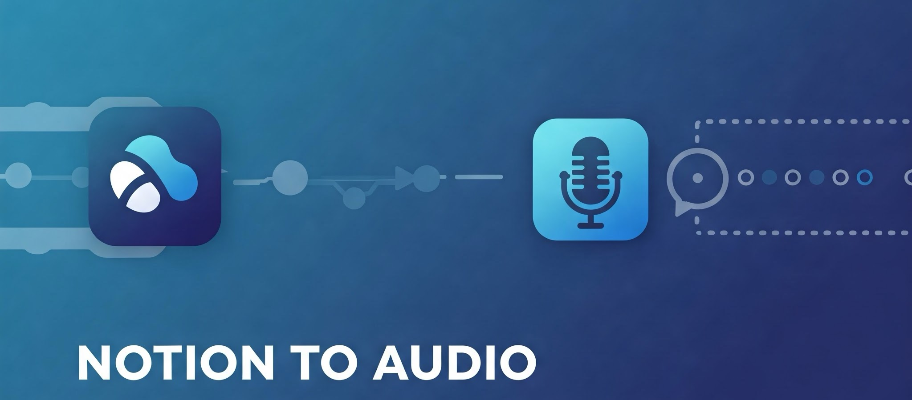

<p align="center">
  
</p>

# <sub><sub>_`NotionToAudio`_ </sub></sub>

[](https://opensource.org/licenses/MIT)
[](https://www.python.org/)
[](https://developers.notion.com/)
[](https://ai.google.dev/)
[](https://github.com/hexgrad/kokoro)
[](https://www.langchain.com/)

A comprehensive pipeline for extracting content from Notion databases, processing it into well-structured transcripts using Google's Gemini AI, and generating natural-sounding audio narrations with Kokoro TTS.

## Features

### 🔄 Complete Content Pipeline
- Seamless extraction of Notion content to PDF and text formats
- Gemini-powered transcript optimization for natural audio narration
- Text-to-speech conversion with multiple voice options
- Parallel processing for efficient content transformation

### 🏗️ Modular Architecture
- **`notion_extract`**: Professional PDF and text extraction from Notion databases
- **`transcript_maker`**: Advanced transcript generation with Gemini 2.0 Flash model
- **`audio_maker`**: High-quality audio generation with Kokoro TTS

### 🚀 Performance
- Parallel processing with ThreadPoolExecutor for faster transcript generation
- Intelligent text chunking with LangChain's RecursiveCharacterTextSplitter
- Smart retry mechanism for API resilience

## Get Started

<details>
<summary>Setup Instructions</summary>

1. Create a Notion integration and get your API key:
   - Go to https://www.notion.so/my-integrations
   - Click "New integration"
   - Give it a name and submit
   - Copy the API key

2. Share your database with the integration:
   - Open your Notion database
   - Click "Share" in the top right
   - Click "Add people, emails, groups, or integrations"
   - Search for your integration name and select it

3. Get your database ID:
   - Open your database in Notion
   - Copy the database ID from the URL:
     - The URL format is: https://www.notion.so/{workspace}/{database_id}?v={view_id}
     - The database ID is a 32-character string

4. Install dependencies:
```bash
pip install -r requirements.txt
```

5. Create a `.env` file with your credentials:
```
NOTION_API_KEY=your_api_key_here
NOTION_DATABASE_ID=your_database_id_here
GEMINI_API_KEY=your_gemini_api_key_here
```

</details>

## Usage

### Component-Specific Commands

<details open>
<summary>Available Commands</summary>

#### Notion to PDF Export
```bash
python -m notion_extract.notion_to_pdf
```

#### Notion to Text Export
```bash
python -m notion_extract.notion_to_txt
```

#### Generate Transcripts from Text
```bash
python -m transcript_maker.transcript_generator_parallel
```

#### Create Audio from Transcripts
```bash
python -m audio_maker.transcript_to_audio
```

</details>

### Complete Workflow

Run the entire pipeline with a single command:

```bash
python -m main --full
```

Or use the interactive menu:

```bash
python -m main
```

## Technical Overview

### 🔍 Notion Extraction
- Uses Notion's official API (notion-client 2.0.0) to retrieve database pages
- Exports to both PDF (using reportlab and PyPDF2) and plain text formats
- Handles pagination and API rate limiting
- Maintains document structure and formatting

### 📝 Transcript Processing
- Processes raw text through Google's Gemini 2.0 Flash model
- Uses LangChain's RecursiveCharacterTextSplitter for optimal text chunking
- Implements parallel processing with ThreadPoolExecutor for efficiency
- Features smart retry mechanism for API resilience
- Handles large documents by breaking content into chunks with context overlap

### 🔊 Audio Generation
- Uses Kokoro TTS for high-quality speech synthesis
- Multiple voice options: "af_heart" (default), "af_calm", "af_bright", "af_serious"
- Configurable parameters:
  - Language selection (American English default)
  - Speech speed adjustment
  - Audio sample rate configuration
- Intelligent audio segment management with numpy and soundfile

## Project Structure

```
notion-pdf/
├── main.py                      # Main entry point with interactive menu
├── requirements.txt             # Project dependencies
├── notion_extract/              # Content extraction from Notion
│   ├── notion_to_pdf.py         # PDF export functionality
│   ├── notion_to_txt.py         # Text export functionality
│   ├── dto/                     # Data transfer objects
│   └── helper/                  # Helper services
├── transcript_maker/            # Transcript generation
│   ├── transcript_generator.py          # Sequential processing
│   ├── transcript_generator_parallel.py # Parallel processing with Gemini AI
│   └── prompt.py                        # Educational prompt templates
├── audio_maker/                 # Audio generation
│   ├── transcript_to_audio.py   # Main audio generation script
│   └── tts_generator.py         # Kokoro TTS implementation
└── output/                      # Generated files
    ├── pdf/                     # PDF export results
    ├── txt/                     # Text export results
    ├── transcripts/             # Generated transcripts
    └── audios/                  # Generated audio files
```

## Requirements

- Python 3.8+
- Notion API key
- Google Gemini API key
- Dependencies:
  - notion-client==2.0.0
  - PyPDF2==3.0.1
  - reportlab==4.1.0
  - google-generativeai==0.3.2
  - kokoro>=0.8.4
  - langchain==0.3.20
  - soundfile>=0.12.1
  - numpy>=1.20.0

## MIT License

Copyright (c) 2023-2024

This is open source software that can be freely shared with anyone. The MIT License allows for:
- Free use, modification, and distribution
- Educational use
- Private use
- No warranty or liability for the software creators
